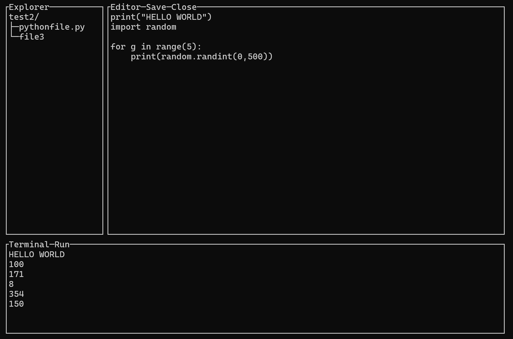

# CPP-Editor
Detta projektet är en terminalbaserad applikation som fortfarande uppfyller kravet för Grafiskt användargränssnitt. Detta görs genom att projektet består av två olika delar. Ena delen är ett Terminalbaserat Grafiskt gränssnitt som liknar HTML med fönster som expanderar och följer begränsningar med deras storlekar. Den andra delen är implementationen av tre sådana här fönster, som tillsammans bygger upp en enkel Editor. Anledningen till att jag valde detta projektet var för att det använde sig av mycket arv, men också av personligt intresse.

## Krav
Detta är kraven som projektet uppnår utöver grundkraven (som projektet redan uppnår alla av):
1. Egendefinerad rimlig generisk klass (Vector2D/Vector4D)
2. Relevant användande av funktionspekare (MenuItem callbacks/TerminalIO onResize callbacks)
3. Relevant användande av Lambdauttryck (MenuItem callbacks/TerminalIO onResize callbacks)
4. Användande av undantagshantering (CPPEditor)
5. Grafiskt användargränssnitt (Hela projektet)

## Förutsättningar
Att du har installerat Podman på linux, eller Docker på windows.
<br>eller<br>
Att du har installerat CMAKE > 4.0, build-essential, python3
## Övrig information
Detta projektet är utvecklat för linux på grund av skillnaden i hur windows och linux hanterar terminaler. Därför har jag gjort mitt bästa att göra det kompitabelt med era datorer genom både Docker/Podman skript som kan köras via `make` på linux eller `run.sh` på windows.
Om detta av något mystiskt sätt skulle misslyckas så har jag instruktioner för att manuellt kompilera och köra koden i `README.md`. Jag har försökt testa på så många maskiner jag kan, och sålänge man har rätt paket (CMAKE, build-essential, python3) så borde det vara okej. Men för att vara säker, använd min container via make eller run.sh.
<br>
Övrigt så ligger lite mer information, tillsammans med keybinds, i `README.md` också, men jag bifogar det även här under för säkerhetens skull:

# README.MD Bifogat:

CPP-Editor is a proof of concept terminal based user interface (TUI) implementing a file explorer, editor and terminal.


## How to run
```bash
git clone https://github.com/et118/CPP-Editor
cd CPP-Editor
```
Now you can either 1: use docker/podman, or 2: compile and run manually
### 1. Docker/Podman
On windows: Click ``run.bat``
<br>
On linux: Run ``make``

### 2. Compile and run manually
```bash
cmake -S . -B build
cmake --build build
./build/CPP-Editor

(optionally run with Valgrind to perform a memory check)
valgrind --leak-check=full ./build/CPP-Editor
```


## Shortcuts
Note: You need to hover your mouse over the Editor window for it to capture your input.

| Key        | Action                  |
|------------|-------------------------|
| Ctrl + S   | Save the current file   |
| Ctrl + Q   | Exit entire application |

## Features
* Automatic scaling
* Loading all text based files
* Saving all text based files
* Running .py files
* Keyboard based text editing
* Mouse based filesystem explorer navigation
* Autosaving on crash

## Shortcomings
* HEAVILY underoptimized (had no time for that). This makes larger files (a couple kilobytes) too slow to run even on a good pc, and might cause freezing during the time it takes to render.
* Cant create new files
* Can't type or handle all characters (Tab, emojis etc.)
* No copy pasting
* No mouse scrolling (though the editor supports keyboard based scrolling)
* Only supports running python files
* Doesnt support displaying the error pipe when running programs
* It supports colors, but i didnt have time to add any
* No way to show notifications for status messages (like if a file is unavailable)